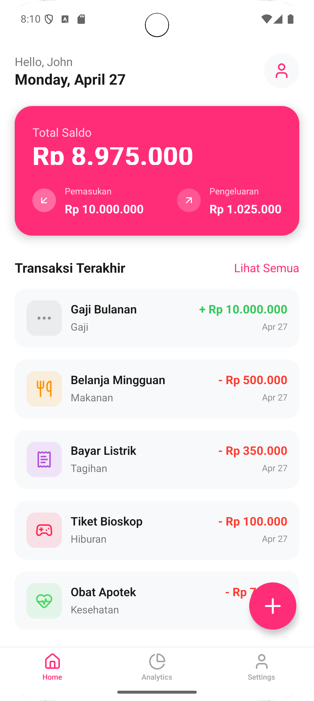
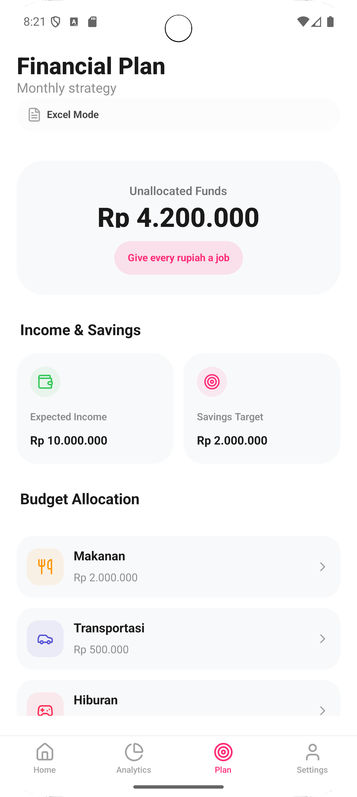
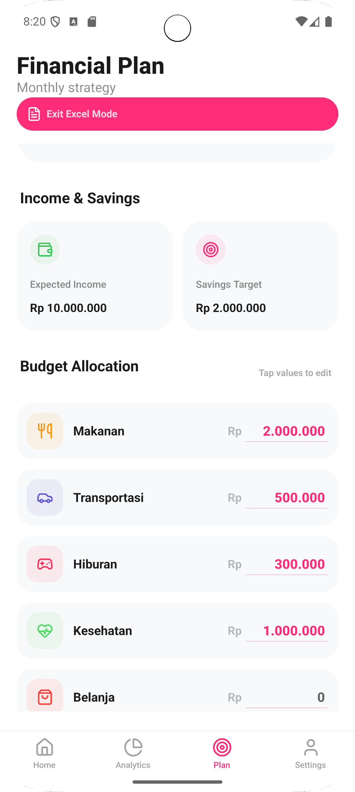
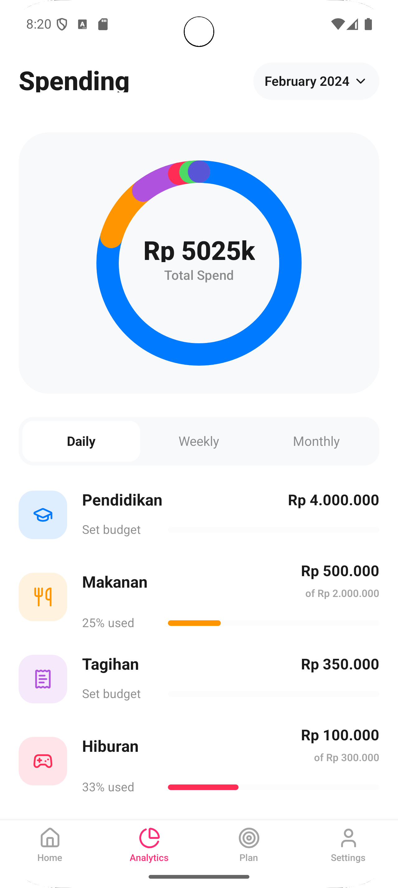
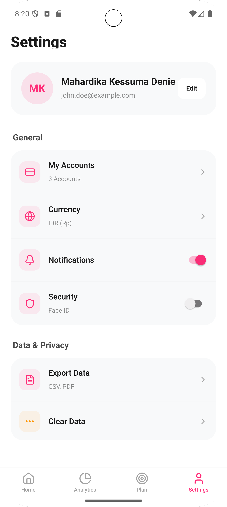

# MyFinance - Personal Financial Strategist

**MyFinance** is a modern, proactive personal finance management application built with React Native and Expo. Unlike traditional trackers that only record past spending, MyFinance empowers users to plan their future using the **Zero-Based Budgeting** method, ensuring every rupiah has a purpose.

---

## 🚀 Key Features

### 1. Proactive Home Dashboard
The command center of your financial life. It provides a real-time summary of your balance, income, and expenses.
- **Smart "On-Track" Monitoring**: An AI-powered logic that compares your spending progress against the time elapsed in the current month. It warns you if you are spending too fast (*OFF TRACK*) and identifies which category is causing the leak.
- **Recent Transactions**: Quick view of your latest activities.
- **Quick Action FAB**: Add transactions in seconds with auto-formatted currency inputs.



### 2. Zero-Based Financial Planning
Stop wondering where your money went and start telling it where to go.
- **Budget Allocation**: Allocate your expected income into savings and various categories until your "Unallocated Funds" reach zero.
- **Excel Mode (Power User)**: A unique rapid-input mode for users who prefer bulk entry. Toggle this mode to edit all category budgets inline without opening modals—just like a spreadsheet.




### 3. Deep Analytics & Budget Health
Visualize your spending habits with a modern, high-contrast UI.
- **Interactive Donut Chart**: Rounded-stroke charts showing category proportions.
- **Budget vs. Actual**: Real-time progress bars for each category. Bars turn **red** instantly if you exceed your planned budget.
- **Category Details**: Detailed breakdown of spending with percentage usage.



### 4. Premium UI/UX Components
- **Custom Gesture BottomSheet**: A native-feel, drag-to-close modal system for all inputs (Date Picker, Budgeting, Profile).
- **Proper Date Selection**: A custom-built calendar modal with "Today" and "Yesterday" presets.
- **Currency Auto-Formatter**: Real-time thousands separator (e.g., `2.000.000`) to prevent input errors.
- **Loading States**: Smooth visual feedback during data submission.

### 5. Personalized Settings
- **Profile Management**: Update your name and email with instant UI synchronization.
- **Currency Toggle**: Switch between IDR (Rp) and USD ($).
- **Data Governance**: Securely clear all data or export your records (Simulation).



---

## 🛠 Tech Stack

- **Framework**: [Expo](https://expo.dev/) (React Native)
- **Navigation**: [Expo Router](https://docs.expo.dev/router/introduction/) (File-based routing)
- **Animation**: [React Native Reanimated](https://www.reanimated.org/)
- **Gestures**: [React Native Gesture Handler](https://docs.swmansion.com/react-native-gesture-handler/)
- **Icons**: [Lucide React Native](https://lucide.dev/guide/packages/lucide-react-native)
- **Charts**: Custom SVG Donut Charts with `react-native-svg`
- **State Management**: React Context API (FinanceContext)

---

## 🏁 Getting Started

1. **Clone the repository**
2. **Install dependencies**:
   ```bash
   npm install
   ```
3. **Start the development server**:
   ```bash
   npx expo start
   ```
4. **Open on your device**: Use the Expo Go app or an emulator to scan the QR code.

---

## 📈 Future Improvements (Economist's Roadmap)
- **Recurring Transactions**: Auto-allocate fixed costs like rent and subscriptions.
- **Needs vs. Wants Tagging**: Implementing the 50/30/20 rule for advanced macro-analysis.
- **Debt/Net Worth Tracker**: Integrating assets and liabilities for a complete financial picture.

---
*Built with ❤️ for better financial health.*
